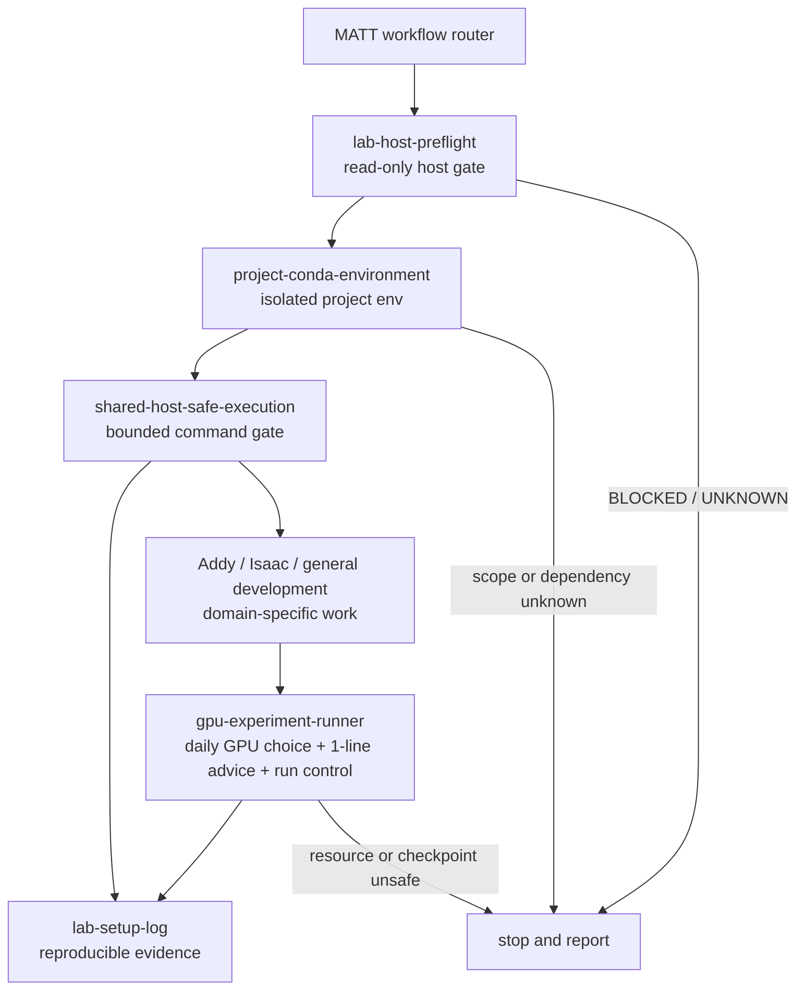

# Lab Host Skills

平時的開發流程是參考 Mattpocock；考量實驗室主機是多人共用的 GPU host，另設計一層位於 MATT 下方的 `Host/Environment Safety Layer`，提供跨 project 共用的 host、Conda、GPU 與執行安全 gates。目標讀者是同樣使用共用電腦的實驗室人員，包括 visitor、碩士生與博士生；在不影響其他使用者、不誤改 shared environment 或他人程序的前提下，安全且可重現地完成個人開發與實驗流程。安全規則可跨 project 共用，但 Conda prefix、dependencies 與 run artifacts 仍維持 project isolation。

## Preconditions

- 實驗室電腦是多人共用的 GPU host；只操作 current user 與已驗證的 user-writable scope。
- 開發流程以 `MATT + Addy + Isaac + 其他 domain skills` 為上層 workflow；本 repo 只提供 host／environment safety gates，不取代 domain logic。
- Python／Node base 屬於使用者；每個 project 必須有獨立 Conda prefix 與 dependency manifest。
- 不修改 system/global/shared Conda、其他 user files/processes；不自動 sudo、restart service、terminate process 或清理 shared data。

## Workflow

## Division of responsibility

| Skill | Owns | Does not own |
| --- | --- | --- |
| `lab-host-preflight` | 唯讀帳號、主機、工具、Conda、GPU、scheduler 健檢 | 安裝、設定、建立 environment |
| `project-conda-environment` | project-specific Conda lifecycle、dependency manifest、export | shared/base Conda、系統套件、GPU allocation |
| `shared-host-safe-execution` | command scope、ownership、timeout、authorization、execution receipt | CUDA／研究邏輯、job scheduling policy |
| `gpu-experiment-runner` | GPU availability、scheduler preference、bounded resources、checkpoint、monitoring | driver／MIG／scheduler 設定、他人 job |
| `lab-setup-log` | 可重現紀錄、evidence、status、未決事項 | 執行安裝或將 partial 證據升格為成功 |

## KV-cache conventions

- 固定術語：`Context Fingerprint`、`Scope Boundary`、`Preflight Manifest`、`Environment Receipt`、`Execution Gate`、`Resource Envelope`、`Allocation Provenance`、`Run Manifest`、`Evidence Ledger`。
- 固定狀態詞：`PLANNED | ATTEMPTED | QUEUED | PASS | PARTIAL | BLOCKED | EVIDENCE_PENDING | UNKNOWN`。
- 各 skill 只保留 domain-specific invariant；共通語意使用相同 term/schema，避免同義改寫與重複 context。
- GPU selection 不跨日快取；每個 calendar day 或 inventory change 必須重新詢問。
- GPU 僅允許 scheduler-managed shared pool；`exclusive`、`private`、`reserved`、direct allocation 或 pool label unknown 一律拒絕。

## Daily GPU selection

`gpu-experiment-runner` 啟動前必須詢問：「今天 GPU 要用哪張？」同一訊息列出 shared-pool candidates 並提供恰好一句 placement recommendation。Scheduler 以 GPU class/count 表達 user intent，再指派 physical index；無 scheduler 時停止。

## Shared-host invariants

- 只處理目前使用者帳號與已確認的個人可寫範圍。
- 不修改系統全域目錄、shared/base Conda、其他使用者檔案或程序。
- 不自動 sudo、重啟服務、終止他人程序、清理共享資料或猜測秘密。
- 未知帳號、路徑、ownership、GPU allocation、scheduler policy 或 quota 時停止並回報。
- GPU 工作先查資源，設定 bounded time／memory／GPU scope 與 checkpoint；有 scheduler 時優先使用。
- MATT 是最高層 router；Addy、Isaac 或其他 domain skills 不得繞過這些 gates。

## Source review

截至 2026-08-27，已查閱以下官方／一手來源。搜尋只用來定位頁面，內容以實際開啟的 repository、README、`SKILL.md` 或官方文件為依據：

| Source | 查證到的可重用內容 | 本產出採用／不採用 |
| --- | --- | --- |
| [agentskills/agentskills README](https://github.com/agentskills/agentskills) | skill 是含 `SKILL.md` 的資料夾；以 discovery → activation → execution progressive disclosure 載入 | 採用獨立資料夾、短 entrypoint、必要時再讀 supporting resources |
| [Agent Skills specification](https://github.com/agentskills/agentskills/blob/main/docs/specification.mdx) | `name`／`description` frontmatter、命名限制、可選 `scripts/`、`references/`、`assets/`、驗證與 progressive disclosure | 採用標準 frontmatter 與命名；未加入沒有實際用途的 scripts/assets |
| [openai/skills README](https://github.com/openai/skills) | Codex skills catalog；頁面明確標記 deprecated，現行 plugin examples 應看 OpenAI Plugins | 僅作歷史格式與來源交叉查證；不安裝、不複製外部 skill |
| [openai/plugins example `SKILL.md`](https://github.com/openai/plugins/blob/main/plugins/openai-developers/skills/openai-platform-api-key/SKILL.md) | 具體 trigger、scope boundary、credential safety 與驗證式 workflow 寫法 | 借鑑「何時使用／何時不要使用」與秘密保護；不採用其 OpenAI API domain content |
| [conda environment management](https://github.com/conda/conda/blob/main/docs/source/user-guide/tasks/manage-environments.rst) | environment create／activate／export、prefix／lockfile、environment variables 概念 | 採用 project-specific prefix、manifest、export；命令仍要求先確認 prefix 與 authorization |
| [SchedMD Slurm `sbatch` documentation](https://github.com/SchedMD/slurm/blob/master/doc/man/man1/sbatch.1) | scheduler 可表達 time、memory、CPU/GPU 與 allocation constraints | 採用「有 scheduler 優先」與 bounded job 概念；不硬編碼 site-specific partition/account syntax |
| [NVIDIA accelerated-computing-hub GPU deployment guide](https://github.com/NVIDIA/accelerated-computing-hub/blob/main/tutorials/gpu-deployment/gpu-deployment-from-scratch.md) | `nvidia-smi`／NVML 可查 GPU count、名稱與 memory 等狀態 | 採用唯讀資源查詢；不把查詢結果推定為 ownership 或 isolation |

### Reuse decision

沒有查到可直接重用、同時覆蓋本任務五項需求與多人共用主機安全邊界的既有 skill。這是「自製原因」：現有來源提供格式、Conda lifecycle、scheduler／GPU observation 等局部模式，但沒有本實驗室所需的 account／write-scope gate、禁止他人程序操作、未知狀態停止、GPU checkpoint 與 evidence status 組合。因此本產出採「格式與通用觀念重用，host safety policy 自製」的方式。

## Validation scope

本目錄的交付只包含可審查 instructions 與 workflow 文件。未執行實際主機安裝、Conda 建環境、GPU job、scheduler submission、sudo、服務變更或外部 skill installation。

